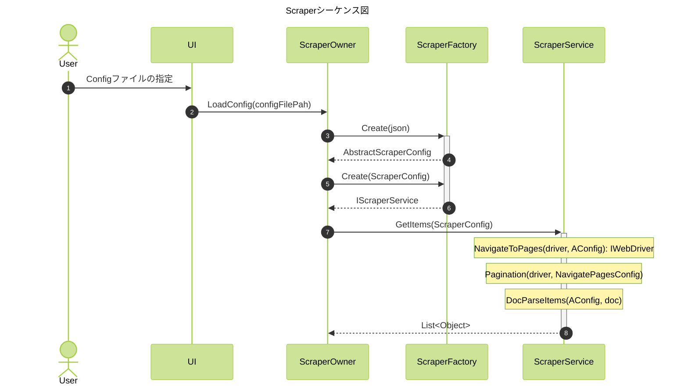

# スクレイピングシステム phase_1

## 概要

このアプリケーションは、**サイトごとに定義された設定ファイル（ScraperConfig.json）をもとにサイトの情報をスクレイピング**するシステムです。  
ユーザーは UI を通じて収集対象のサイト設定を選択し、ScraperOwner クラスがその設定を元にスクレイピングを実行します。  
phase_1ではconfigファイルからスクレイピングを実行する機能を実装しました。  
phase_2以降にconfigファイルを選択するGUI, configファイルを作成する機能を実装予定です。  

---

## シーケンス図

---

## 構成要素

### ✅ UI
- ユーザーの操作に応じて、対象となる `ScraperConfig.json` ファイルを選択
- ScraperOwner に設定ファイル名を渡す

### ✅ ScraperOwner
- `ScraperConfig.json` を読み込み、内容を解析
- 構成情報に従って `AbstractScraperConfig` のサブクラスインスタンス（例：PostsScraperConfig）を生成
- スクレイピング処理を実行

### ✅ IScraperOwner（インターフェース）
- ScraperOwner の依存性注入と処理の共通化のためのインターフェース
- `ScraperConfig.json` の解釈と、ScraperConfig クラスの生成・実行を担う

### ✅ AbstractScraperConfig（抽象クラス）
- 各サイトカテゴリに共通するスクレイピング設定の基本クラス

### ✅ PostsScraperConfig（具象クラス）
- 投稿系レス収集の設定クラス
- `AbstractScraperConfig` を継承し、サイトカテゴリに応じた具体的設定を記述

---

## 入力ファイル構成例

- `ScraperConfig.json`:
  各スクレイピング対象サイトの構造を記述する設定ファイル。
  ```json
  {
    "URL": "https://example.com/thread",
    "LIST_NODE": "div.list",
    "POST_NODE": "div.post",
    "USER_ID_NODE": "span.userid",
    "TEXT_NODE": "p.text",
    "DATE_NODE": "span.date"
  }
