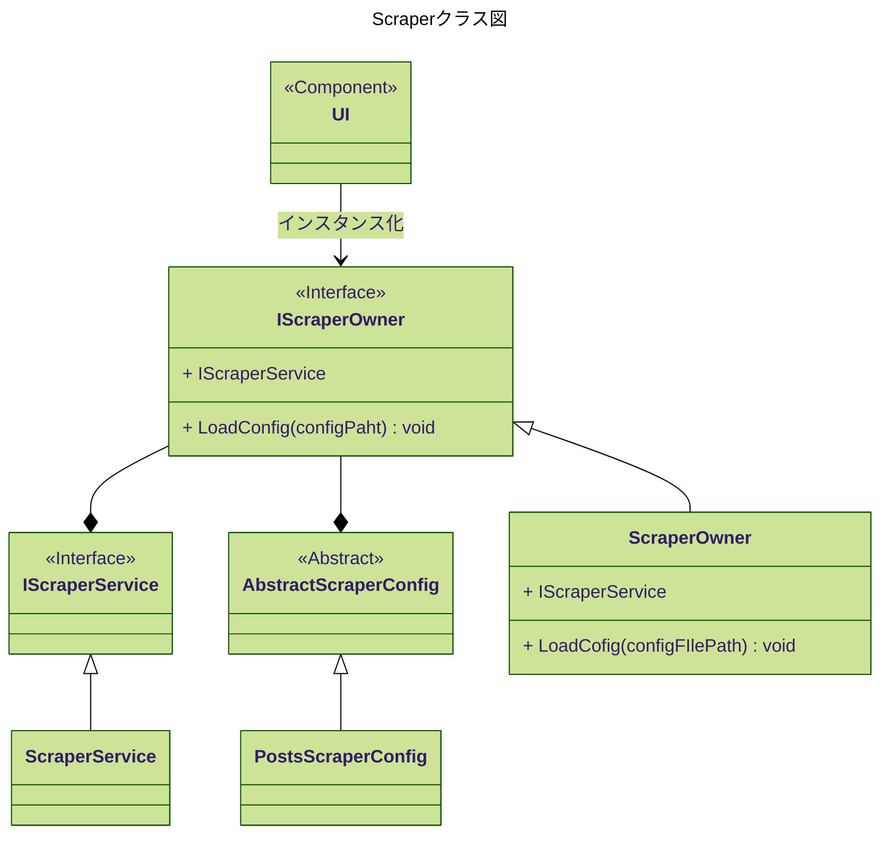

```mermaid
---
title: Scraperクラス図
config:
  theme: forest
---
classDiagram

%% Interfact,Abstract,Component定義
class UI
<<Component>> UI
class IScraperOwner {
    <<Interface>>
    + IScraperService 
    + LoadConfig(configPaht)void
}
class IScraperService
<<Interface>>IScraperService
class AbstractScraperConfig
<<Abstract>>AbstractScraperConfig

%% クラス定義
class ScraperOwner{
    + IScraperService
    + LoadCofig(configFIlePath)void
}
class ScraperService

class PostsScraperConfig

%% 関連
UI --> IScraperOwner: インスタンス化
IScraperOwner <|-- ScraperOwner
IScraperOwner --* IScraperService
IScraperService <|-- ScraperService
IScraperOwner --* AbstractScraperConfig
AbstractScraperConfig <|-- PostsScraperConfig
```