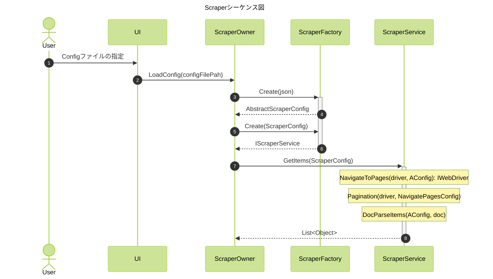

```mermaid
---
title: Scraperシーケンス図
config:
  theme: forest
---
sequenceDiagram
autonumber
actor User
participant UI
participant ScraperOwner
participant ScraperFactory

User ->> UI: Configファイルの指定
UI ->> ScraperOwner: LoadConfig(configFilePah)
ScraperOwner ->> +ScraperFactory: Create(json)
ScraperFactory -->> ScraperOwner: AbstractScraperConfig
ScraperOwner ->> ScraperFactory: Create(ScraperConfig)
ScraperFactory -->> -ScraperOwner: IScraperService
ScraperOwner ->> +ScraperService: GetItems(ScraperConfig)
Note over ScraperService:  NavigateToPages(driver, AConfig): IWebDriver
Note over ScraperService: Pagination(driver, NavigatePagesConfig)
Note over ScraperService : DocParseItems(AConfig, doc)
ScraperService -->> -ScraperOwner:List<Object>
```