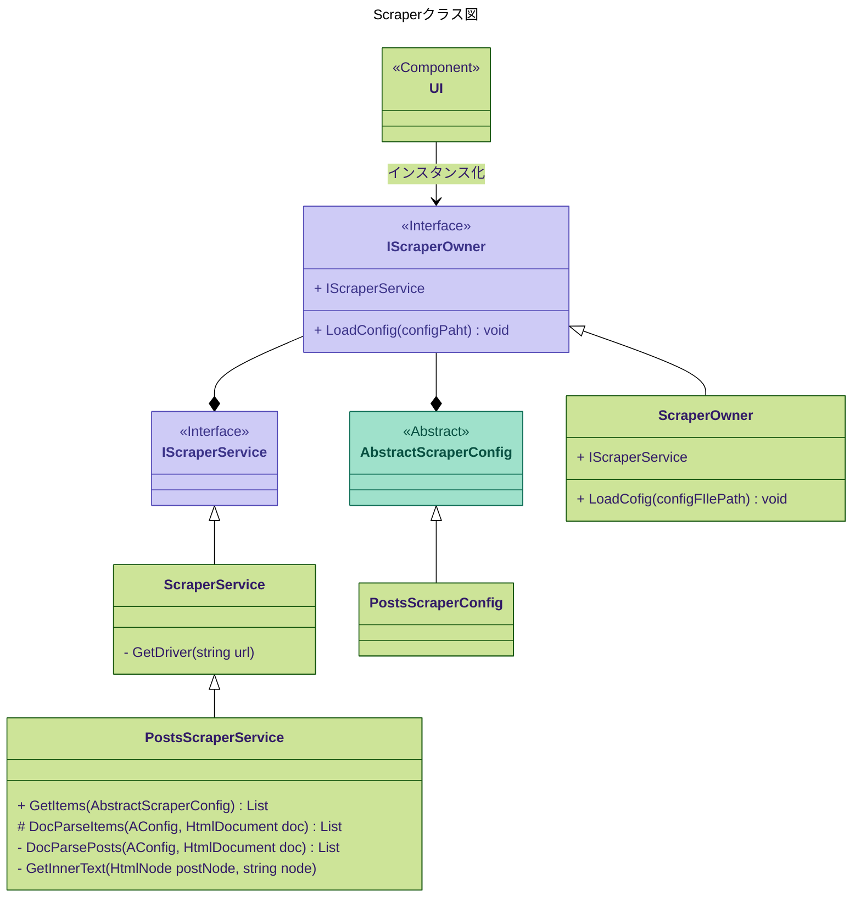

```mermaid
---
title: Scraperクラス図
config:
  theme: forest
---
classDiagram

%% Interfact,Abstract,Component定義
class UI
<<Component>> UI
class IScraperOwner :::interfaceStyle {
    <<Interface>>
    + IScraperService 
    + LoadConfig(configPaht)void
}
class IScraperService:::interfaceStyle
<<Interface>>IScraperService
class AbstractScraperConfig :::abstractStyle
<<Abstract>>AbstractScraperConfig

%% クラス定義
class ScraperOwner {
    + IScraperService
    + LoadCofig(configFIlePath)void
}
class ScraperService {
  - GetDriver(string url)
}

class PostsScraperConfig

class PostsScraperService {
  + GetItems(AbstractScraperConfig) List<Object>
  # DocParseItems(AConfig, HtmlDocument doc) List<Object>
  - DocParsePosts(AConfig, HtmlDocument doc) List<Object>
  - GetInnerText(HtmlNode postNode, string node)
}

%% 関連
UI --> IScraperOwner: インスタンス化
IScraperOwner <|-- ScraperOwner
IScraperOwner --* IScraperService
IScraperService <|-- ScraperService
ScraperService <|-- PostsScraperService
IScraperOwner --* AbstractScraperConfig
AbstractScraperConfig <|-- PostsScraperConfig

classDef interfaceStyle fill:#CECBF6,stroke:#534AB7,color:#3C3489
classDef abstractStyle fill:#9FE1CB,stroke:#0F6E56,color:#085041
```